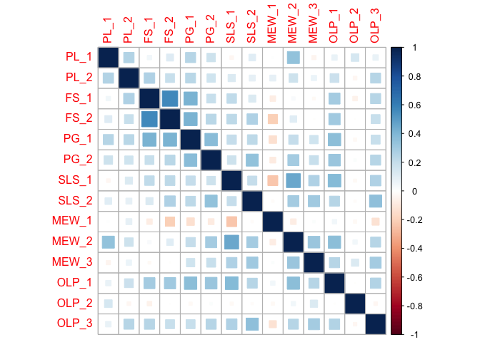
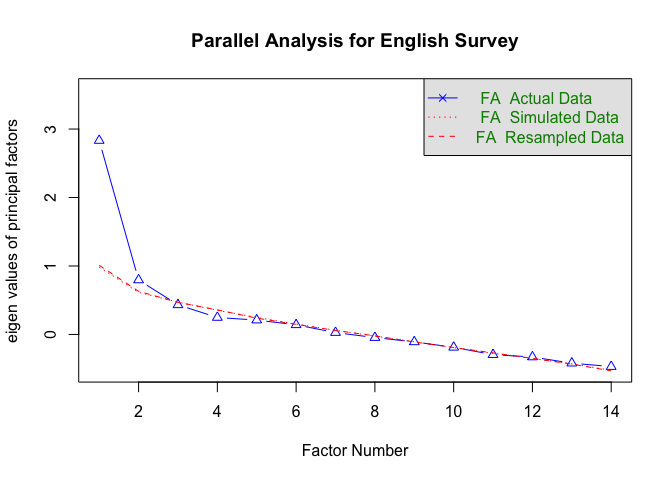
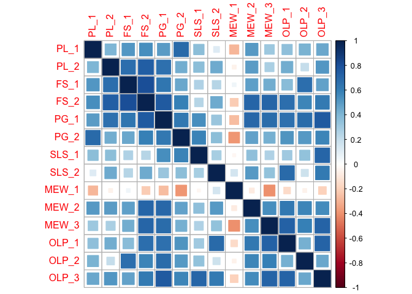
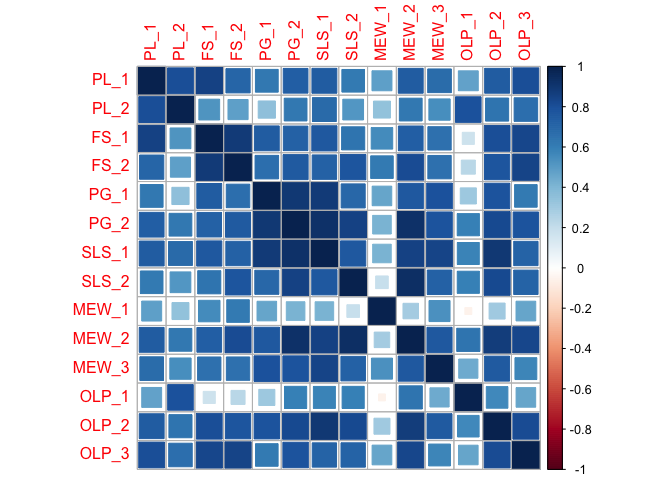
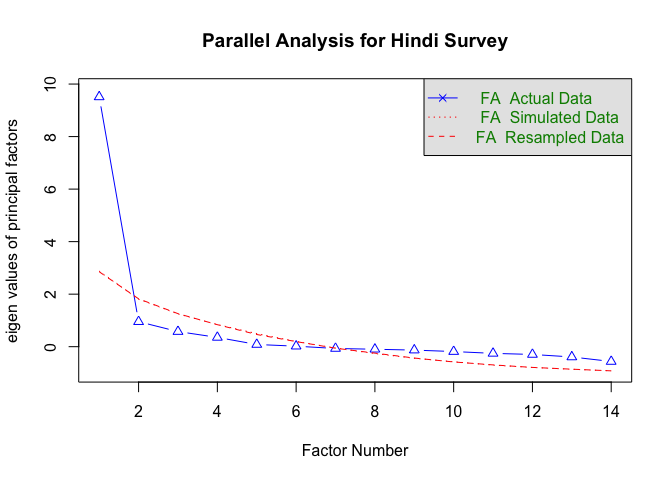
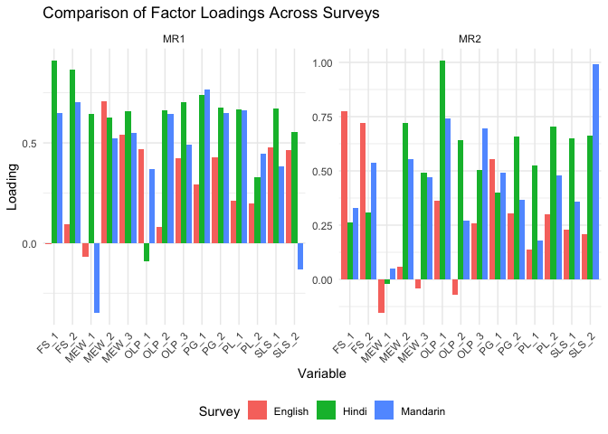

Public Health Measure: Research Paper
================
Kajal Gupta
2024-12-12

``` r
# Load necessary libraries
library(readxl)
library(dplyr)
library(psych)
library(readxl)
library(corrplot)
# File path to the survey data
file_path <- "Psychometric Analysis_ProjectSurvey.xlsx"
```

# Section 1: English Survey

``` r
# Load the English survey
english_survey <- read_excel(file_path, sheet = "English")

# Handle missing values by replacing them with column means
english_survey <- english_survey %>%
  mutate(across(c(PL_1, PL_2, FS_1, FS_2, PG_1, PG_2, SLS_1, SLS_2,
                  MEW_1, MEW_2, MEW_3, OLP_1, OLP_2, OLP_3),
                ~ ifelse(is.na(.), mean(., na.rm = TRUE), .)))

# Creating Matrix
english_matrix <- as.matrix(english_survey[, c("PL_1", "PL_2", "FS_1", "FS_2", "PG_1", "PG_2", 
                                                "SLS_1", "SLS_2", "MEW_1", "MEW_2", "MEW_3", 
                                                "OLP_1", "OLP_2", "OLP_3")])

# Calculate Cronbach's alpha
english_alpha <- alpha(english_matrix, check.keys = TRUE)
```

    ## Warning in alpha(english_matrix, check.keys = TRUE): Some items were negatively correlated with the first principal component and were automatically reversed.
    ##  This is indicated by a negative sign for the variable name.

``` r
print("Cronbach's Alpha for English Survey:")
```

    ## [1] "Cronbach's Alpha for English Survey:"

``` r
print(english_alpha)
```

    ## 
    ## Reliability analysis   
    ## Call: alpha(x = english_matrix, check.keys = TRUE)
    ## 
    ##   raw_alpha std.alpha G6(smc) average_r S/N   ase mean  sd median_r
    ##        0.7      0.75    0.78      0.17 2.9 0.049  5.2 0.6     0.19
    ## 
    ##     95% confidence boundaries 
    ##          lower alpha upper
    ## Feldt     0.60   0.7  0.79
    ## Duhachek  0.61   0.7  0.80
    ## 
    ##  Reliability if an item is dropped:
    ##        raw_alpha std.alpha G6(smc) average_r S/N alpha se var.r med.r
    ## PL_1        0.70      0.74    0.77      0.18 2.9    0.050 0.019  0.20
    ## PL_2        0.69      0.74    0.78      0.18 2.8    0.051 0.020  0.20
    ## FS_1        0.68      0.73    0.76      0.17 2.7    0.053 0.017  0.19
    ## FS_2        0.67      0.72    0.76      0.17 2.6    0.055 0.018  0.18
    ## PG_1        0.66      0.71    0.75      0.16 2.5    0.055 0.019  0.18
    ## PG_2        0.68      0.72    0.76      0.17 2.6    0.052 0.020  0.19
    ## SLS_1       0.67      0.72    0.76      0.17 2.6    0.054 0.019  0.18
    ## SLS_2       0.68      0.73    0.77      0.17 2.6    0.052 0.020  0.19
    ## MEW_1-      0.72      0.75    0.79      0.19 3.1    0.047 0.019  0.21
    ## MEW_2       0.67      0.72    0.75      0.16 2.5    0.053 0.019  0.19
    ## MEW_3       0.69      0.74    0.77      0.18 2.8    0.050 0.019  0.19
    ## OLP_1       0.68      0.72    0.76      0.16 2.5    0.053 0.019  0.18
    ## OLP_2       0.74      0.76    0.80      0.20 3.2    0.042 0.017  0.21
    ## OLP_3       0.68      0.72    0.76      0.17 2.6    0.053 0.020  0.18
    ## 
    ##  Item statistics 
    ##         n raw.r std.r r.cor r.drop mean   sd
    ## PL_1   81  0.36  0.37 0.301  0.225  5.6 1.24
    ## PL_2   81  0.40  0.43 0.349  0.282  5.3 1.10
    ## FS_1   81  0.54  0.50 0.472  0.376  4.6 1.62
    ## FS_2   81  0.60  0.57 0.543  0.467  4.9 1.46
    ## PG_1   81  0.61  0.62 0.593  0.504  5.4 1.26
    ## PG_2   81  0.51  0.57 0.518  0.436  6.0 0.82
    ## SLS_1  81  0.54  0.55 0.518  0.421  5.5 1.29
    ## SLS_2  81  0.49  0.53 0.475  0.378  5.6 1.15
    ## MEW_1- 81  0.33  0.27 0.167  0.138  3.1 1.69
    ## MEW_2  81  0.55  0.59 0.572  0.448  5.2 1.08
    ## MEW_3  81  0.41  0.43 0.366  0.275  5.5 1.26
    ## OLP_1  81  0.54  0.59 0.559  0.459  5.7 0.88
    ## OLP_2  81  0.25  0.17 0.039  0.025  4.8 1.91
    ## OLP_3  81  0.53  0.55 0.497  0.416  5.1 1.14
    ## 
    ## Non missing response frequency for each item
    ##          1    2    3    4    5    6    7 miss
    ## PL_1  0.01 0.00 0.09 0.04 0.27 0.37 0.22    0
    ## PL_2  0.01 0.00 0.05 0.11 0.43 0.27 0.12    0
    ## FS_1  0.07 0.06 0.10 0.15 0.30 0.26 0.06    0
    ## FS_2  0.02 0.04 0.12 0.12 0.31 0.26 0.12    0
    ## PG_1  0.00 0.04 0.04 0.11 0.30 0.30 0.22    0
    ## PG_2  0.00 0.00 0.01 0.04 0.17 0.54 0.23    0
    ## SLS_1 0.00 0.04 0.06 0.07 0.20 0.41 0.22    0
    ## SLS_2 0.00 0.01 0.05 0.10 0.25 0.38 0.21    0
    ## MEW_1 0.02 0.12 0.05 0.14 0.26 0.21 0.20    0
    ## MEW_2 0.01 0.01 0.01 0.17 0.40 0.31 0.09    0
    ## MEW_3 0.00 0.05 0.04 0.04 0.28 0.38 0.21    0
    ## OLP_1 0.00 0.00 0.01 0.07 0.26 0.48 0.17    0
    ## OLP_2 0.12 0.02 0.12 0.06 0.19 0.33 0.15    0
    ## OLP_3 0.00 0.02 0.07 0.12 0.41 0.27 0.10    0

``` r
# Measure Criterion Validity (Correlation Matrix)
english_correlation <- cor(english_matrix)
print("Criterion Validity (Correlation Matrix) for English Survey:")
```

    ## [1] "Criterion Validity (Correlation Matrix) for English Survey:"

``` r
print(english_correlation)
```

    ##               PL_1        PL_2        FS_1         FS_2        PG_1        PG_2
    ## PL_1   1.000000000  0.25760888  0.04957577  0.119540546  0.24606275  0.17412275
    ## PL_2   0.257608877  1.00000000  0.26781872  0.190927176  0.23863698  0.16614699
    ## FS_1   0.049575773  0.26781872  1.00000000  0.563512779  0.41475753  0.19024714
    ## FS_2   0.119540546  0.19092718  0.56351278  1.000000000  0.41180265  0.23770570
    ## PG_1   0.246062746  0.23863698  0.41475753  0.411802649  1.00000000  0.37087808
    ## PG_2   0.174122749  0.16614699  0.19024714  0.237705699  0.37087808  1.00000000
    ## SLS_1 -0.034466267  0.12758337  0.21783685  0.227200649  0.20947735  0.17862958
    ## SLS_2  0.108608745  0.08928458  0.12369611  0.264264143  0.22811326  0.34808525
    ## MEW_1  0.008567879  0.08743157 -0.07546011 -0.205908424 -0.13687316 -0.08460224
    ## MEW_2  0.345880998  0.17707417  0.02944307  0.105090585  0.20996810  0.29416402
    ## MEW_3 -0.043539888  0.06845555 -0.02116675 -0.005065879  0.16879299  0.19634948
    ## OLP_1  0.070949995  0.18902465  0.29109633  0.305901304  0.36786817  0.32740879
    ## OLP_2  0.142218771 -0.03438985 -0.05195487 -0.002159952 -0.02638948  0.01602588
    ## OLP_3  0.074088574  0.24142745  0.24570426  0.193132794  0.19477784  0.24632965
    ##             SLS_1       SLS_2        MEW_1       MEW_2        MEW_3
    ## PL_1  -0.03446627  0.10860874  0.008567879  0.34588100 -0.043539888
    ## PL_2   0.12758337  0.08928458  0.087431569  0.17707417  0.068455552
    ## FS_1   0.21783685  0.12369611 -0.075460112  0.02944307 -0.021166747
    ## FS_2   0.22720065  0.26426414 -0.205908424  0.10509059 -0.005065879
    ## PG_1   0.20947735  0.22811326 -0.136873161  0.20996810  0.168792987
    ## PG_2   0.17862958  0.34808525 -0.084602242  0.29416402  0.196349480
    ## SLS_1  1.00000000  0.20152193 -0.237591558  0.45984527  0.262223040
    ## SLS_2  0.20152193  1.00000000 -0.015770720  0.29163227  0.303016246
    ## MEW_1 -0.23759156 -0.01577072  1.000000000 -0.07828411  0.013797376
    ## MEW_2  0.45984527  0.29163227 -0.078284114  1.00000000  0.326331642
    ## MEW_3  0.26222304  0.30301625  0.013797376  0.32633164  1.000000000
    ## OLP_1  0.38323058  0.24055530  0.048871763  0.36036284  0.248204136
    ## OLP_2 -0.02590695 -0.01499855 -0.026913316  0.04820087  0.129341972
    ## OLP_3  0.26633259  0.35435964 -0.122690245  0.24360287  0.292051719
    ##              OLP_1        OLP_2       OLP_3
    ## PL_1   0.070949995  0.142218771  0.07408857
    ## PL_2   0.189024646 -0.034389854  0.24142745
    ## FS_1   0.291096327 -0.051954872  0.24570426
    ## FS_2   0.305901304 -0.002159952  0.19313279
    ## PG_1   0.367868173 -0.026389477  0.19477784
    ## PG_2   0.327408792  0.016025882  0.24632965
    ## SLS_1  0.383230579 -0.025906955  0.26633259
    ## SLS_2  0.240555299 -0.014998552  0.35435964
    ## MEW_1  0.048871763 -0.026913316 -0.12269025
    ## MEW_2  0.360362835  0.048200871  0.24360287
    ## MEW_3  0.248204136  0.129341972  0.29205172
    ## OLP_1  1.000000000 -0.003204949  0.25698965
    ## OLP_2 -0.003204949  1.000000000 -0.03156490
    ## OLP_3  0.256989647 -0.031564901  1.00000000

``` r
corrplot(english_correlation, method = "square") 
```

<!-- -->

``` r
# Conduct Exploratory Factor Analysis (EFA)
fa.parallel(english_matrix, fa = "fa", n.iter = 100, main = "Parallel Analysis for English Survey")
```

<!-- -->

    ## Parallel analysis suggests that the number of factors =  2  and the number of components =  NA

``` r
english_efa <- fa(english_matrix, nfactors = 2, rotate = "varimax")
print("EFA for English Survey:")
```

    ## [1] "EFA for English Survey:"

``` r
print(english_efa)
```

    ## Factor Analysis using method =  minres
    ## Call: fa(r = english_matrix, nfactors = 2, rotate = "varimax")
    ## Standardized loadings (pattern matrix) based upon correlation matrix
    ##         MR1   MR2    h2   u2 com
    ## PL_1   0.21  0.14 0.063 0.94 1.7
    ## PL_2   0.20  0.30 0.130 0.87 1.7
    ## FS_1   0.00  0.77 0.598 0.40 1.0
    ## FS_2   0.09  0.72 0.528 0.47 1.0
    ## PG_1   0.29  0.55 0.392 0.61 1.5
    ## PG_2   0.43  0.30 0.273 0.73 1.8
    ## SLS_1  0.48  0.23 0.281 0.72 1.4
    ## SLS_2  0.47  0.21 0.259 0.74 1.4
    ## MEW_1 -0.07 -0.15 0.028 0.97 1.4
    ## MEW_2  0.71  0.06 0.502 0.50 1.0
    ## MEW_3  0.54 -0.04 0.294 0.71 1.0
    ## OLP_1  0.47  0.36 0.348 0.65 1.9
    ## OLP_2  0.08 -0.07 0.011 0.99 2.0
    ## OLP_3  0.42  0.26 0.246 0.75 1.7
    ## 
    ##                        MR1  MR2
    ## SS loadings           2.00 1.95
    ## Proportion Var        0.14 0.14
    ## Cumulative Var        0.14 0.28
    ## Proportion Explained  0.51 0.49
    ## Cumulative Proportion 0.51 1.00
    ## 
    ## Mean item complexity =  1.5
    ## Test of the hypothesis that 2 factors are sufficient.
    ## 
    ## df null model =  91  with the objective function =  2.99 with Chi Square =  222.52
    ## df of  the model are 64  and the objective function was  0.75 
    ## 
    ## The root mean square of the residuals (RMSR) is  0.07 
    ## The df corrected root mean square of the residuals is  0.08 
    ## 
    ## The harmonic n.obs is  81 with the empirical chi square  63.53  with prob <  0.49 
    ## The total n.obs was  81  with Likelihood Chi Square =  55.02  with prob <  0.78 
    ## 
    ## Tucker Lewis Index of factoring reliability =  1.1
    ## RMSEA index =  0  and the 90 % confidence intervals are  0 0.047
    ## BIC =  -226.23
    ## Fit based upon off diagonal values = 0.91
    ## Measures of factor score adequacy             
    ##                                                    MR1  MR2
    ## Correlation of (regression) scores with factors   0.85 0.88
    ## Multiple R square of scores with factors          0.73 0.77
    ## Minimum correlation of possible factor scores     0.46 0.54

# Section 2: Mandarin Survey

``` r
# Load the Mandarin survey
mandarin_survey <- read_excel(file_path, sheet = "Mandarin")

# Handle missing values by replacing them with column means
mandarin_survey <- mandarin_survey %>%
  mutate(across(c(PL_1, PL_2, FS_1, FS_2, PG_1, PG_2, SLS_1, SLS_2,
                  MEW_1, MEW_2, MEW_3, OLP_1, OLP_2, OLP_3),
                ~ ifelse(is.na(.), mean(., na.rm = TRUE), .)))

# Creating Matrix
mandarin_matrix <- as.matrix(mandarin_survey[, c("PL_1", "PL_2", "FS_1", "FS_2", "PG_1", "PG_2", 
                                                  "SLS_1", "SLS_2", "MEW_1", "MEW_2", "MEW_3", 
                                                  "OLP_1", "OLP_2", "OLP_3")])

# Calculate Cronbach's alpha
mandarin_alpha <- alpha(mandarin_matrix, check.keys = TRUE)
```

    ## Warning in alpha(mandarin_matrix, check.keys = TRUE): Some items were negatively correlated with the first principal component and were automatically reversed.
    ##  This is indicated by a negative sign for the variable name.

``` r
print("Cronbach's Alpha for Mandarin Survey:")
```

    ## [1] "Cronbach's Alpha for Mandarin Survey:"

``` r
print(mandarin_alpha)
```

    ## 
    ## Reliability analysis   
    ## Call: alpha(x = mandarin_matrix, check.keys = TRUE)
    ## 
    ##   raw_alpha std.alpha G6(smc) average_r S/N   ase mean   sd median_r
    ##       0.91      0.92    0.98      0.45  12 0.028  4.7 0.92     0.47
    ## 
    ##     95% confidence boundaries 
    ##          lower alpha upper
    ## Feldt     0.84  0.91  0.96
    ## Duhachek  0.86  0.91  0.97
    ## 
    ##  Reliability if an item is dropped:
    ##        raw_alpha std.alpha G6(smc) average_r  S/N alpha se var.r med.r
    ## PL_1        0.91      0.92    0.98      0.46 11.1    0.030 0.045  0.48
    ## PL_2        0.91      0.92    0.98      0.46 11.0    0.030 0.043  0.48
    ## FS_1        0.91      0.92    0.98      0.45 10.8    0.031 0.041  0.47
    ## FS_2        0.90      0.91    0.98      0.43  9.9    0.033 0.040  0.45
    ## PG_1        0.90      0.91    0.97      0.43  9.9    0.034 0.041  0.45
    ## PG_2        0.90      0.91    0.97      0.45 10.5    0.032 0.046  0.46
    ## SLS_1       0.91      0.92    0.98      0.47 11.6    0.028 0.042  0.50
    ## SLS_2       0.91      0.92    0.97      0.47 11.7    0.029 0.038  0.50
    ## MEW_1-      0.93      0.93    0.99      0.51 13.3    0.024 0.026  0.51
    ## MEW_2       0.91      0.91    0.98      0.45 10.5    0.031 0.044  0.45
    ## MEW_3       0.90      0.91    0.98      0.45 10.6    0.031 0.043  0.47
    ## OLP_1       0.90      0.91    0.98      0.45 10.4    0.031 0.042  0.46
    ## OLP_2       0.91      0.92    0.98      0.46 11.0    0.030 0.042  0.47
    ## OLP_3       0.90      0.91    0.97      0.44 10.1    0.032 0.042  0.44
    ## 
    ##  Item statistics 
    ##         n raw.r std.r r.cor r.drop mean   sd
    ## PL_1   20  0.67  0.66  0.64   0.61  4.9 1.25
    ## PL_2   20  0.68  0.68  0.68   0.62  4.7 1.38
    ## FS_1   20  0.73  0.71  0.71   0.65  4.0 1.70
    ## FS_2   20  0.88  0.88  0.88   0.85  4.5 1.40
    ## PG_1   20  0.90  0.89  0.89   0.87  4.2 1.48
    ## PG_2   20  0.79  0.78  0.77   0.74  5.0 1.36
    ## SLS_1  20  0.58  0.58  0.57   0.49  4.8 1.60
    ## SLS_2  20  0.50  0.55  0.55   0.45  5.3 0.92
    ## MEW_1- 20  0.32  0.30  0.27   0.20  3.2 1.68
    ## MEW_2  20  0.75  0.77  0.77   0.72  5.0 0.83
    ## MEW_3  20  0.75  0.75  0.75   0.70  5.7 1.13
    ## OLP_1  20  0.75  0.78  0.77   0.70  5.2 1.24
    ## OLP_2  20  0.69  0.68  0.67   0.62  4.1 1.45
    ## OLP_3  20  0.84  0.85  0.85   0.81  5.2 1.07
    ## 
    ## Non missing response frequency for each item
    ##          1    2    3    4    5    6    7 miss
    ## PL_1  0.00 0.05 0.05 0.25 0.35 0.20 0.10    0
    ## PL_2  0.00 0.05 0.20 0.15 0.25 0.30 0.05    0
    ## FS_1  0.05 0.20 0.15 0.25 0.10 0.20 0.05    0
    ## FS_2  0.00 0.10 0.15 0.20 0.30 0.20 0.05    0
    ## PG_1  0.00 0.15 0.15 0.30 0.15 0.20 0.05    0
    ## PG_2  0.00 0.05 0.05 0.25 0.25 0.25 0.15    0
    ## SLS_1 0.05 0.10 0.00 0.15 0.25 0.40 0.05    0
    ## SLS_2 0.00 0.00 0.05 0.10 0.40 0.40 0.05    0
    ## MEW_1 0.00 0.15 0.15 0.05 0.20 0.35 0.10    0
    ## MEW_2 0.00 0.00 0.00 0.30 0.50 0.15 0.05    0
    ## MEW_3 0.00 0.00 0.05 0.10 0.20 0.40 0.25    0
    ## OLP_1 0.00 0.05 0.05 0.15 0.20 0.50 0.05    0
    ## OLP_2 0.00 0.15 0.25 0.15 0.30 0.10 0.05    0
    ## OLP_3 0.00 0.00 0.00 0.30 0.30 0.25 0.15    0

``` r
# Measure Criterion Validity (Correlation Matrix)
mandarin_correlation <- cor(mandarin_matrix)
print("Criterion Validity (Correlation Matrix) for Mandarin Survey:")
```

    ## [1] "Criterion Validity (Correlation Matrix) for Mandarin Survey:"

``` r
print(mandarin_correlation)
```

    ##             PL_1        PL_2       FS_1       FS_2       PG_1       PG_2
    ## PL_1   1.0000000  0.40798329 0.51648095  0.5420802  0.4961371  0.6847950
    ## PL_2   0.4079833  1.00000000 0.66591426  0.7377490  0.6559302  0.4301437
    ## FS_1   0.5164809  0.66591426 1.00000000  0.8094838  0.6315581  0.4575167
    ## FS_2   0.5420802  0.73774898 0.80948379  1.0000000  0.7505730  0.5978800
    ## PG_1   0.4961371  0.65593024 0.63155807  0.7505730  1.0000000  0.6217443
    ## PG_2   0.6847950  0.43014369 0.45751669  0.5978800  0.6217443  1.0000000
    ## SLS_1  0.3601785  0.36018701 0.26814599  0.2477387  0.5497337  0.5862717
    ## SLS_2  0.1183335  0.44597649 0.24467044  0.4492978  0.3268385  0.3656269
    ## MEW_1 -0.2873429 -0.05667565 0.05060106 -0.2130264 -0.2691490 -0.3864577
    ## MEW_2  0.5039555  0.49419075 0.48545730  0.7081022  0.6988601  0.4723975
    ## MEW_3  0.3127976  0.27704600 0.43053466  0.7017958  0.6763983  0.4229352
    ## OLP_1  0.3525606  0.43675977 0.37946202  0.6693147  0.6587311  0.5258892
    ## OLP_2  0.4123241  0.20022476 0.66502046  0.5732978  0.6746258  0.5067534
    ## OLP_3  0.4517104  0.51675428 0.47004549  0.6168898  0.7549593  0.5712515
    ##             SLS_1     SLS_2       MEW_1      MEW_2      MEW_3      OLP_1
    ## PL_1   0.36017853 0.1183335 -0.28734290  0.5039555  0.3127976  0.3525606
    ## PL_2   0.36018701 0.4459765 -0.05667565  0.4941907  0.2770460  0.4367598
    ## FS_1   0.26814599 0.2446704  0.05060106  0.4854573  0.4305347  0.3794620
    ## FS_2   0.24773868 0.4492978 -0.21302644  0.7081022  0.7017958  0.6693147
    ## PG_1   0.54973368 0.3268385 -0.26914896  0.6988601  0.6763983  0.6587311
    ## PG_2   0.58627170 0.3656269 -0.38645772  0.4723975  0.4229352  0.5258892
    ## SLS_1  1.00000000 0.2816923 -0.03425738  0.3529505  0.2654845  0.3080860
    ## SLS_2  0.28169229 1.0000000  0.15249857  0.5039999  0.3434343  0.6804760
    ## MEW_1 -0.03425738 0.1524986  1.00000000 -0.0852822 -0.4020417 -0.1514505
    ## MEW_2  0.35295047 0.5039999 -0.08528220  1.0000000  0.5479352  0.6273841
    ## MEW_3  0.26548445 0.3434343 -0.40204169  0.5479352  1.0000000  0.7222742
    ## OLP_1  0.30808599 0.6804760 -0.15145046  0.6273841  0.7222742  1.0000000
    ## OLP_2  0.34806093 0.1732821 -0.05405169  0.5770253  0.5993268  0.4282722
    ## OLP_3  0.70009529 0.6126476 -0.19741716  0.5511594  0.7191950  0.7142520
    ##             OLP_2      OLP_3
    ## PL_1   0.41232406  0.4517104
    ## PL_2   0.20022476  0.5167543
    ## FS_1   0.66502046  0.4700455
    ## FS_2   0.57329781  0.6168898
    ## PG_1   0.67462576  0.7549593
    ## PG_2   0.50675341  0.5712515
    ## SLS_1  0.34806093  0.7000953
    ## SLS_2  0.17328207  0.6126476
    ## MEW_1 -0.05405169 -0.1974172
    ## MEW_2  0.57702533  0.5511594
    ## MEW_3  0.59932684  0.7191950
    ## OLP_1  0.42827221  0.7142520
    ## OLP_2  1.00000000  0.4588414
    ## OLP_3  0.45884141  1.0000000

``` r
corrplot(mandarin_correlation, method = "square") 
```

<!-- -->

``` r
# Conduct Exploratory Factor Analysis (EFA)
fa.parallel(mandarin_matrix, fa = "fa", n.iter = 100, main = "Parallel Analysis for Mandarin Survey")
```

<!-- -->

    ## Parallel analysis suggests that the number of factors =  1  and the number of components =  NA

``` r
mandarin_efa <- fa(mandarin_matrix, nfactors = 2, rotate = "varimax")
```

    ## Warning in fa.stats(r = r, f = f, phi = phi, n.obs = n.obs, np.obs = np.obs, :
    ## The estimated weights for the factor scores are probably incorrect.  Try a
    ## different factor score estimation method.

``` r
print("EFA for Mandarin Survey:")
```

    ## [1] "EFA for Mandarin Survey:"

``` r
print(mandarin_efa)
```

    ## Factor Analysis using method =  minres
    ## Call: fa(r = mandarin_matrix, nfactors = 2, rotate = "varimax")
    ## Standardized loadings (pattern matrix) based upon correlation matrix
    ##         MR1  MR2   h2     u2 com
    ## PL_1   0.66 0.18 0.47 0.5294 1.1
    ## PL_2   0.45 0.48 0.43 0.5738 2.0
    ## FS_1   0.65 0.33 0.53 0.4717 1.5
    ## FS_2   0.70 0.54 0.79 0.2142 1.9
    ## PG_1   0.77 0.49 0.83 0.1695 1.7
    ## PG_2   0.65 0.37 0.56 0.4434 1.6
    ## SLS_1  0.38 0.36 0.27 0.7253 2.0
    ## SLS_2 -0.13 0.99 1.00 0.0024 1.0
    ## MEW_1 -0.35 0.05 0.12 0.8780 1.0
    ## MEW_2  0.52 0.55 0.58 0.4216 2.0
    ## MEW_3  0.55 0.47 0.53 0.4746 2.0
    ## OLP_1  0.37 0.74 0.69 0.3144 1.5
    ## OLP_2  0.65 0.27 0.49 0.5086 1.3
    ## OLP_3  0.49 0.70 0.73 0.2719 1.8
    ## 
    ##                        MR1  MR2
    ## SS loadings           4.22 3.78
    ## Proportion Var        0.30 0.27
    ## Cumulative Var        0.30 0.57
    ## Proportion Explained  0.53 0.47
    ## Cumulative Proportion 0.53 1.00
    ## 
    ## Mean item complexity =  1.6
    ## Test of the hypothesis that 2 factors are sufficient.
    ## 
    ## df null model =  91  with the objective function =  16.42 with Chi Square =  221.7
    ## df of  the model are 64  and the objective function was  8.01 
    ## 
    ## The root mean square of the residuals (RMSR) is  0.1 
    ## The df corrected root mean square of the residuals is  0.12 
    ## 
    ## The harmonic n.obs is  20 with the empirical chi square  35.68  with prob <  1 
    ## The total n.obs was  20  with Likelihood Chi Square =  97.4  with prob <  0.0045 
    ## 
    ## Tucker Lewis Index of factoring reliability =  0.563
    ## RMSEA index =  0.153  and the 90 % confidence intervals are  0.094 0.23
    ## BIC =  -94.32
    ## Fit based upon off diagonal values = 0.96

# Section 3: Hindi Survey

``` r
# Load the Hindi survey
hindi_survey <- read_excel(file_path, sheet = "Hindi")

# Handle missing values by replacing them with column means
hindi_survey <- hindi_survey %>%
  mutate(across(c(PL_1, PL_2, FS_1, FS_2, PG_1, PG_2, SLS_1, SLS_2,
                  MEW_1, MEW_2, MEW_3, OLP_1, OLP_2, OLP_3),
                ~ ifelse(is.na(.), mean(., na.rm = TRUE), .)))

# Creating Matrix
hindi_matrix <- as.matrix(hindi_survey[, c("PL_1", "PL_2", "FS_1", "FS_2", "PG_1", "PG_2", 
                                            "SLS_1", "SLS_2", "MEW_1", "MEW_2", "MEW_3", 
                                            "OLP_1", "OLP_2", "OLP_3")])

# Calculate Cronbach's alpha
hindi_alpha <- alpha(hindi_matrix, check.keys = TRUE)
```

    ## Warning in cor.smooth(r): Matrix was not positive definite, smoothing was done

``` r
print("Cronbach's Alpha for Hindi Survey:")
```

    ## [1] "Cronbach's Alpha for Hindi Survey:"

``` r
print(hindi_alpha)
```

    ## 
    ## Reliability analysis   
    ## Call: alpha(x = hindi_matrix, check.keys = TRUE)
    ## 
    ##   raw_alpha std.alpha G6(smc) average_r S/N   ase mean  sd median_r
    ##       0.96      0.96    0.98      0.66  27 0.017    5 1.3     0.71
    ## 
    ##     95% confidence boundaries 
    ##          lower alpha upper
    ## Feldt     0.92  0.96  0.99
    ## Duhachek  0.93  0.96  0.99
    ## 
    ##  Reliability if an item is dropped:
    ##       raw_alpha std.alpha G6(smc) average_r S/N var.r med.r
    ## PL_1       0.96      0.96    0.98      0.65  24 0.041  0.71
    ## PL_2       0.96      0.96    0.98      0.67  26 0.039  0.73
    ## FS_1       0.96      0.96    0.99      0.65  25 0.037  0.70
    ## FS_2       0.96      0.96    0.98      0.65  24 0.038  0.71
    ## PG_1       0.96      0.96    0.98      0.66  25 0.038  0.72
    ## PG_2       0.95      0.96    0.98      0.64  23 0.038  0.68
    ## SLS_1      0.95      0.96    0.98      0.64  23 0.038  0.67
    ## SLS_2      0.96      0.96    0.99      0.65  25 0.038  0.71
    ## MEW_1      0.97      0.97    0.99      0.70  31 0.024  0.74
    ## MEW_2      0.95      0.96    0.99      0.64  23 0.037  0.68
    ## MEW_3      0.96      0.96    0.99      0.66  25 0.041  0.72
    ## OLP_1      0.96      0.97    0.99      0.69  29 0.026  0.74
    ## OLP_2      0.96      0.96    0.99      0.64  24 0.038  0.68
    ## OLP_3      0.96      0.96    0.99      0.65  24 0.040  0.70
    ## 
    ##  Item statistics 
    ##        n raw.r std.r r.cor r.drop mean  sd
    ## PL_1  12  0.86  0.87  0.86   0.84  5.1 1.3
    ## PL_2  12  0.75  0.75  0.72   0.70  4.9 1.7
    ## FS_1  12  0.85  0.86  0.86   0.82  5.1 1.6
    ## FS_2  12  0.86  0.86  0.85   0.83  5.3 1.4
    ## PG_1  12  0.83  0.83  0.81   0.80  5.2 1.6
    ## PG_2  12  0.94  0.94  0.93   0.93  5.6 1.7
    ## SLS_1 12  0.94  0.93  0.93   0.92  5.0 1.8
    ## SLS_2 12  0.85  0.85  0.85   0.82  5.2 1.5
    ## MEW_1 12  0.54  0.52  0.49   0.45  4.2 2.0
    ## MEW_2 12  0.93  0.94  0.94   0.92  5.5 1.7
    ## MEW_3 12  0.85  0.84  0.83   0.82  5.0 1.5
    ## OLP_1 12  0.59  0.59  0.59   0.52  5.0 1.6
    ## OLP_2 12  0.91  0.92  0.92   0.90  4.8 1.1
    ## OLP_3 12  0.87  0.88  0.87   0.85  4.7 1.2
    ## 
    ## Non missing response frequency for each item
    ##          1    2    3    4 4.81818181818182    5 5.45454545454545    6    7 miss
    ## PL_1  0.00 0.08 0.08 0.00             0.00 0.33             0.00 0.50 0.00    0
    ## PL_2  0.00 0.17 0.08 0.00             0.00 0.33             0.00 0.25 0.17    0
    ## FS_1  0.08 0.00 0.08 0.00             0.00 0.33             0.00 0.42 0.08    0
    ## FS_2  0.00 0.08 0.00 0.17             0.00 0.17             0.00 0.42 0.17    0
    ## PG_1  0.00 0.08 0.17 0.00             0.00 0.17             0.00 0.42 0.17    0
    ## PG_2  0.00 0.08 0.08 0.08             0.00 0.08             0.00 0.25 0.42    0
    ## SLS_1 0.08 0.00 0.08 0.17             0.00 0.17             0.00 0.33 0.17    0
    ## SLS_2 0.00 0.08 0.00 0.25             0.00 0.17             0.00 0.25 0.25    0
    ## MEW_1 0.08 0.17 0.17 0.17             0.00 0.00             0.00 0.33 0.08    0
    ## MEW_2 0.00 0.08 0.08 0.08             0.00 0.08             0.08 0.25 0.33    0
    ## MEW_3 0.00 0.08 0.00 0.42             0.00 0.00             0.00 0.33 0.17    0
    ## OLP_1 0.00 0.08 0.08 0.25             0.00 0.08             0.00 0.33 0.17    0
    ## OLP_2 0.00 0.08 0.00 0.17             0.08 0.42             0.00 0.25 0.00    0
    ## OLP_3 0.00 0.08 0.08 0.17             0.00 0.42             0.00 0.25 0.00    0

``` r
# Measure Criterion Validity (Correlation Matrix)
hindi_correlation <- cor(hindi_matrix)
print("Criterion Validity (Correlation Matrix) for Hindi Survey:")
```

    ## [1] "Criterion Validity (Correlation Matrix) for Hindi Survey:"

``` r
print(hindi_correlation)
```

    ##            PL_1      PL_2      FS_1      FS_2      PG_1      PG_2     SLS_1
    ## PL_1  1.0000000 0.8048326 0.8515698 0.7082968 0.6261553 0.7380415 0.7491898
    ## PL_2  0.8048326 1.0000000 0.5213076 0.4881317 0.3573397 0.6253165 0.6875123
    ## FS_1  0.8515698 0.5213076 1.0000000 0.8853596 0.7454380 0.7265893 0.7654162
    ## FS_2  0.7082968 0.4881317 0.8853596 1.0000000 0.6684268 0.7566041 0.7204382
    ## PG_1  0.6261553 0.3573397 0.7454380 0.6684268 1.0000000 0.8906825 0.8816256
    ## PG_2  0.7380415 0.6253165 0.7265893 0.7566041 0.8906825 1.0000000 0.9266470
    ## SLS_1 0.7491898 0.6875123 0.7654162 0.7204382 0.8816256 0.9266470 1.0000000
    ## SLS_2 0.6170434 0.5187968 0.6442577 0.7789241 0.6987721 0.8589914 0.7698812
    ## MEW_1 0.4813151 0.3472905 0.5581444 0.6145226 0.4630622 0.4176278 0.4152460
    ## MEW_2 0.7466004 0.6260103 0.7380513 0.8198387 0.7678053 0.9232938 0.8522136
    ## MEW_3 0.6763668 0.5469220 0.6564652 0.6590820 0.7921394 0.7862004 0.8408410
    ## OLP_1 0.4779598 0.7905408 0.1757183 0.2381653 0.3122692 0.5929056 0.5833834
    ## OLP_2 0.7471532 0.6436375 0.8057431 0.7704607 0.7819334 0.8238560 0.8908427
    ## OLP_3 0.8072360 0.6688740 0.8351086 0.8403431 0.6146160 0.7827249 0.7141428
    ##           SLS_2       MEW_1     MEW_2     MEW_3       OLP_1     OLP_2     OLP_3
    ## PL_1  0.6170434  0.48131513 0.7466004 0.6763668  0.47795979 0.7471532 0.8072360
    ## PL_2  0.5187968  0.34729049 0.6260103 0.5469220  0.79054082 0.6436375 0.6688740
    ## FS_1  0.6442577  0.55814441 0.7380513 0.6564652  0.17571825 0.8057431 0.8351086
    ## FS_2  0.7789241  0.61452264 0.8198387 0.6590820  0.23816526 0.7704607 0.8403431
    ## PG_1  0.6987721  0.46306222 0.7678053 0.7921394  0.31226918 0.7819334 0.6146160
    ## PG_2  0.8589914  0.41762781 0.9232938 0.7862004  0.59290562 0.8238560 0.7827249
    ## SLS_1 0.7698812  0.41524604 0.8522136 0.8408410  0.58338335 0.8908427 0.7141428
    ## SLS_2 1.0000000  0.19198782 0.9378822 0.7272811  0.59016889 0.8216550 0.7171372
    ## MEW_1 0.1919878  1.00000000 0.2903729 0.5342085 -0.05719736 0.3092154 0.4695296
    ## MEW_2 0.9378822  0.29037294 1.0000000 0.7622668  0.64775769 0.8749077 0.8315556
    ## MEW_3 0.7272811  0.53420852 0.7622668 1.0000000  0.44474959 0.7531751 0.5764614
    ## OLP_1 0.5901689 -0.05719736 0.6477577 0.4447496  1.00000000 0.5629429 0.4629100
    ## OLP_2 0.8216550  0.30921539 0.8749077 0.7531751  0.56294295 1.0000000 0.8140806
    ## OLP_3 0.7171372  0.46952957 0.8315556 0.5764614  0.46291005 0.8140806 1.0000000

``` r
corrplot(hindi_correlation, method = "square") 
```

<!-- -->

``` r
# Conduct Exploratory Factor Analysis (EFA)
fa.parallel(hindi_matrix, fa = "fa", n.iter = 100, main = "Parallel Analysis for Hindi Survey")
```

    ## Warning in cor.smooth(r): Matrix was not positive definite, smoothing was done

    ## Warning in fa.stats(r = r, f = f, phi = phi, n.obs = n.obs, np.obs = np.obs, :
    ## The estimated weights for the factor scores are probably incorrect.  Try a
    ## different factor score estimation method.

    ## In factor.scores, the correlation matrix is singular, the pseudo inverse is  used

<!-- -->

    ## Parallel analysis suggests that the number of factors =  1  and the number of components =  NA

``` r
hindi_efa <- fa(hindi_matrix, nfactors = 2, rotate = "varimax")
```

    ## Warning in cor.smooth(r): Matrix was not positive definite, smoothing was done

    ## Warning in cor.smooth(r): The estimated weights for the factor scores are
    ## probably incorrect.  Try a different factor score estimation method.

    ## Warning in fac(r = r, nfactors = nfactors, n.obs = n.obs, rotate = rotate, : An
    ## ultra-Heywood case was detected.  Examine the results carefully

    ## In factor.scores, the correlation matrix is singular, the pseudo inverse is  used

``` r
print("EFA for Hindi Survey:")
```

    ## [1] "EFA for Hindi Survey:"

``` r
print(hindi_efa)
```

    ## Factor Analysis using method =  minres
    ## Call: fa(r = hindi_matrix, nfactors = 2, rotate = "varimax")
    ## Standardized loadings (pattern matrix) based upon correlation matrix
    ##         MR1   MR2   h2     u2 com
    ## PL_1   0.67  0.52 0.72  0.282 1.9
    ## PL_2   0.33  0.70 0.60  0.397 1.4
    ## FS_1   0.91  0.26 0.90  0.104 1.2
    ## FS_2   0.87  0.31 0.85  0.154 1.2
    ## PG_1   0.74  0.40 0.71  0.294 1.5
    ## PG_2   0.67  0.66 0.89  0.113 2.0
    ## SLS_1  0.67  0.65 0.87  0.126 2.0
    ## SLS_2  0.55  0.66 0.74  0.257 1.9
    ## MEW_1  0.64 -0.02 0.41  0.586 1.0
    ## MEW_2  0.63  0.72 0.91  0.091 2.0
    ## MEW_3  0.66  0.49 0.68  0.322 1.9
    ## OLP_1 -0.09  1.01 1.02 -0.021 1.0
    ## OLP_2  0.66  0.64 0.85  0.153 2.0
    ## OLP_3  0.70  0.51 0.75  0.249 1.8
    ## 
    ##                        MR1  MR2
    ## SS loadings           6.07 4.82
    ## Proportion Var        0.43 0.34
    ## Cumulative Var        0.43 0.78
    ## Proportion Explained  0.56 0.44
    ## Cumulative Proportion 0.56 1.00
    ## 
    ## Mean item complexity =  1.6
    ## Test of the hypothesis that 2 factors are sufficient.
    ## 
    ## df null model =  91  with the objective function =  82.77 with Chi Square =  455.21
    ## df of  the model are 64  and the objective function was  65.91 
    ## 
    ## The root mean square of the residuals (RMSR) is  0.07 
    ## The df corrected root mean square of the residuals is  0.08 
    ## 
    ## The harmonic n.obs is  12 with the empirical chi square  10.31  with prob <  1 
    ## The total n.obs was  12  with Likelihood Chi Square =  274.62  with prob <  6.8e-28 
    ## 
    ## Tucker Lewis Index of factoring reliability =  -0.18
    ## RMSEA index =  0.516  and the 90 % confidence intervals are  0.481 0.614
    ## BIC =  115.59
    ## Fit based upon off diagonal values = 0.99

## Interpretation

#### **Cronbach’s Alpha**

Cronbach’s alpha is a measure of internal consistency or reliability for
a set of items in a survey.

1.  **English Survey**: Cronbach’s alpha was 0.7 (standardized = 0.75),
    indicating acceptable reliability. However, items such as `MEW_1`
    had low item-total correlation, suggesting potential misalignment
    with the overall construct.
2.  **Mandarin Survey**: Cronbach’s alpha was 0.91 (standardized =
    0.92), indicating excellent reliability. Most items contributed well
    to the scale’s consistency.
3.  **Hindi Survey**: Cronbach’s alpha was 0.96 (standardized = 0.96),
    indicating excellent reliability. All items aligned strongly with
    the overall scale, though some items showed redundancy (e.g., high
    inter-item correlations).

#### **Exploratory Factor Analysis (EFA)**

EFA identifies latent factors underlying the survey items.

1.  **English Survey**:
    - Parallel analysis suggested retaining 2 factors, capturing 28%
      cumulative variance.
    - Items like `FS_1` and `FS_2` loaded strongly on Factor 2,
      representing a distinct dimension (possibly career-related
      confidence).
    - Some items (e.g., `MEW_1`) had low communalities, suggesting weak
      alignment with identified factors.
2.  **Mandarin Survey**:
    - Parallel analysis suggested 1 factor but analysis retained 2 for
      comparison.
    - Factor 1 captured career confidence, while Factor 2 included items
      like `SLS_2` and `MEW_2`, reflecting social and emotional
      resilience.
    - The cumulative variance explained was 57%, showing a robust factor
      structure.
3.  **Hindi Survey**:
    - Parallel analysis suggested 1 factor, but retaining 2 explained
      78% cumulative variance.
    - Factor 1 captured professional readiness, while Factor 2 included
      `OLP_1` and `SLS_2`, indicating lifestyle alignment.
    - Items like `MEW_1` showed weak communalities, indicating poor fit.

#### **Criterion Validity**

Criterion validity examines how well items correlate with the constructs
they are designed to measure.

1.  **English Survey**:
    - Correlation coefficients among items were moderate (0.2–0.6).
      Items `OLP_2` and `MEW_1` had lower correlations with others,
      suggesting potential construct divergence.
    - High correlations within subsets (e.g., `PG_1`, `PG_2`) indicated
      consistent measurement of subdimensions.
2.  **Mandarin Survey**:
    - Strong correlations (0.4–0.8) were observed among items like
      `PG_1` and `MEW_2`, supporting convergent validity.
    - Negative correlations for `MEW_1` indicated misalignment with the
      construct, possibly due to item wording or interpretation
      differences.
3.  **Hindi Survey**:
    - High correlations (\>0.7) among most items indicated strong
      internal validity.
    - Items `OLP_1` and `MEW_1` had weaker correlations, suggesting they
      might measure distinct constructs.

### Summary

The psychometric evaluation revealed: - **High reliability** across
surveys, with Cronbach’s alpha consistently above 0.7, indicating
reliable scales. Items with low correlations may need revision or
removal. - **EFA insights**: English and Mandarin surveys revealed
two-factor structures, while the Hindi survey leaned towards a single
dominant factor with minimal cross-loadings. - **Criterion validity**:
Correlation patterns supported construct validity, though some items
(e.g., `MEW_1` and `OLP_2`) showed weak alignment and might benefit from
rewording or exclusion.

Further refinements, such as re-evaluating weak items and exploring
cultural differences in interpretation, can enhance the robustness of
the survey instruments.

**Interpretation of the three corrplot**:

1.  **English Survey Corrplot**:
    - The correlations are **moderate**, with coefficients ranging
      between 0.2–0.6.
    - Substantial positive correlations were observed between related
      constructs like **FS_1 and FS_2** (financial stability) and **PG_1
      and PG_2** (personal growth), indicating consistency in measuring
      dimensions.
    - Items like **MEW_1** and **OLP_2** showed weaker or negative
      correlations, suggesting misalignment or distinct constructs.
2.  **Mandarin Survey Corrplot**:
    - Correlations are **stronger** overall, with many values between
      0.4–0.8.
    - Constructs like **PG_1** and **FS_2** show high interrelations,
      supporting convergent validity.
    - Negative correlations, especially with **MEW_1**, highlight a
      potential issue with item wording or interpretation, particularly
      in the Mandarin context.
3.  **Hindi Survey Corrplot**:
    - The correlations are **very strong**, with coefficients frequently
      exceeding 0.7, indicating a high degree of internal consistency.
    - Constructs like **FS_1 and FS_2**, **PG_1 and PG_2**, and **SLS_1
      and SLS_2** are highly interrelated, showing redundancy.
    - Items such as **MEW_1** and **OLP_1** showed relatively lower
      correlations, suggesting they may measure slightly different or
      independent constructs.

**In summary:** - **English**: Moderate consistency but weak spots
(e.g., MEW_1). - **Mandarin**: Strong correlations overall, with MEW_1
as a potential outlier. - **Hindi**: Very high internal consistency but
some redundancy across items.

### Comparison Of Construct Validity Across The Three Survey

``` r
# Extract loadings for comparison
english_loadings <- as.data.frame(english_efa$loadings[])
mandarin_loadings <- as.data.frame(mandarin_efa$loadings[])
hindi_loadings <- as.data.frame(hindi_efa$loadings[])

# Add survey labels to each dataset
english_loadings$Survey <- "English"
mandarin_loadings$Survey <- "Mandarin"
hindi_loadings$Survey <- "Hindi"

# Combine loadings into one data frame
combined_loadings <- bind_rows(
  english_loadings %>% mutate(Variable = rownames(.)),
  mandarin_loadings %>% mutate(Variable = rownames(.)),
  hindi_loadings %>% mutate(Variable = rownames(.))
)

# Reshape data for easier comparison
library(tidyr)
comparison_table <- combined_loadings %>%
  pivot_longer(cols = starts_with("MR"), names_to = "Factor", values_to = "Loading") %>%
  arrange(Variable, Survey, Factor)

# Print combined comparison table
print("Comparison of EFA Loadings Across Surveys:")
```

    ## [1] "Comparison of EFA Loadings Across Surveys:"

``` r
print(comparison_table)
```

    ## # A tibble: 84 × 4
    ##    Survey   Variable Factor  Loading
    ##    <chr>    <chr>    <chr>     <dbl>
    ##  1 English  FS_1     MR1    -0.00372
    ##  2 English  FS_1     MR2     0.773  
    ##  3 Hindi    FS_1     MR1     0.909  
    ##  4 Hindi    FS_1     MR2     0.263  
    ##  5 Mandarin FS_1     MR1     0.649  
    ##  6 Mandarin FS_1     MR2     0.328  
    ##  7 English  FS_2     MR1     0.0935 
    ##  8 English  FS_2     MR2     0.721  
    ##  9 Hindi    FS_2     MR1     0.867  
    ## 10 Hindi    FS_2     MR2     0.306  
    ## # ℹ 74 more rows

``` r
# Load ggplot2 for visualization
library(ggplot2)
```

    ## Warning: package 'ggplot2' was built under R version 4.3.2

    ## 
    ## Attaching package: 'ggplot2'

    ## The following objects are masked from 'package:psych':
    ## 
    ##     %+%, alpha

``` r
# Create a bar plot for loadings comparison
ggplot(comparison_table, aes(x = Variable, y = Loading, fill = Survey)) +
  geom_bar(stat = "identity", position = "dodge") +
  facet_wrap(~Factor, scales = "free_y") +
  theme_minimal() +
  labs(
    title = "Comparison of Factor Loadings Across Surveys",
    x = "Variable",
    y = "Loading",
    fill = "Survey"
  ) +
  theme(
    axis.text.x = element_text(angle = 45, hjust = 1),
    legend.position = "bottom"
  )
```

<!-- -->

### **Interpretation of Two Factors (MR1 and MR2) Based on Construct Validity**

The analysis of the survey items reveals two distinct factors (**MR1**
and **MR2**) that capture different dimensions of students’ perceptions
about life after graduation. These factors help explain the underlying
structure of the data, providing insight into how various aspects of
life—such as **financial stability**, **personal growth**, **mental and
emotional well-being**, **social life**, **overall perception** and
**professional life**—are interrelated.

### **Factor 1: MR1 (Holistic Life Outlook)**

**MR1** appears to capture a broad, **holistic perspective** of life
after graduation. It reflects internal perceptions, including overall
life satisfaction, personal development, emotional well-being,social
support and all other. The following items load strongly on **MR1**:

- **FS (Financial Stability)**:
  - **FS_1** and **FS_2** show moderate loadings, particularly in Hindi
    and Mandarin (e.g., **FS_1**: Hindi = 0.909, Mandarin = 0.648). This
    indicates that students’ perceptions of financial security
    contribute to **MR1**, but the factor is more prominent for
    non-English speakers.
- **PG (Personal Growth)**:
  - **PG_1** and **PG_2** load moderately on **MR1** across all
    languages, showing that personal development and growth are integral
    to this holistic outlook (e.g., **PG_1**: Hindi = 0.74, Mandarin =
    0.77).
- **MEW (Mental & Emotional Well-being)**:
  - **MEW_1**, **MEW_2**, and **MEW_3** have strong loadings on **MR1**,
    indicating that mental and emotional well-being play a central role
    in **MR1**. These items particularly load high in Hindi and English
    (e.g., **MEW_2**: Hindi = 0.72, English = 0.71).
- **SLS (Social Life & Support)**:
  - Items **SLS_1** and **SLS_2** load moderately in Hindi (e.g.,
    **SLS_1**: Hindi = 0.67). This suggests that social life and support
    are part of a student’s general well-being and are closely linked to
    **MR1**.
- **PL (Professional Life)**:
  - Items like **PL_1** and **PL_2** have moderate loadings, especially
    in Hindi and Mandarin (e.g., **PL_1**: Hindi = 0.67, Mandarin =
    0.66). These loadings suggest that **MR1** also captures students’
    perceptions of their professional lives post-graduation, especially
    for non-English speakers.

### **Factor 2: MR2 (External and Practical Aspects)**

**MR2**, in contrast, seems to focus on more **external, practical
aspects** of life after graduation, such as financial security and
social support. This factor reflects tangible, real-world aspects that
are more easily observed and measured. The following items load strongly
on **MR2**:

- **FS (Financial Stability)**:
  - Items **FS_1** and **FS_2** load strongly on **MR2**, especially in
    English (e.g., **FS_1**: English = 0.77). This shows that financial
    stability is a key component of **MR2**, reflecting its tangible,
    external importance to students’ future outlook.
- **PG (Personal Growth)**:
  - Items **PG_1** and **PG_2** load moderately on **MR2** (e.g.,
    **PG_1**: English = 0.55, Mandarin = 0.49), indicating that while
    personal growth is important, it is considered somewhat more
    externally related in this factor.
- **MEW (Mental & Emotional Well-being)**:
  - Items **MEW_2** and **MEW_3** show strong loadings on **MR2**,
    particularly in Hindi (e.g., **MEW_2**: Hindi = 0.72). This suggests
    that emotional well-being, while internal, is linked with the
    external experiences and circumstances students face after
    graduation.
- **SLS (Social Life & Support)**:
  - **SLS_2** loads very strongly in Mandarin (e.g., **SLS_2**: Mandarin
    = 0.99). This indicates that social life and support are crucial in
    **MR2**, especially in terms of tangible, real-world support
    systems.
- **PL (Professional Life)**:
  - Items like **PL_1** and **PL_2** load weakly or moderately on
    **MR2**, with higher loadings in non-English languages (e.g.,
    **PL_1**: Hindi = 0.52). This reflects that while professional life
    is part of the factor, it is less central than other dimensions such
    as financial stability or social life.

### **Comparison Between MR1 and MR2**

The two factors, **MR1** and **MR2**, both include all six categories
(Financial Stability, Personal Growth, Mental & Emotional Well-being,
Social Life & Support, and Professional Life), but they differ in terms
of **focus** and **dimension**:

1.  **MR1**:
    - Represents a **holistic view** of life after graduation,
      encompassing overall satisfaction, personal growth, mental
      well-being, social connections, and professional life.
    - Focuses on internal, **subjective perceptions** of life after
      graduation, where aspects like emotional well-being and personal
      growth play a significant role.
    - The factor loadings suggest that **MR1** is more prominent in
      non-English surveys (Hindi and Mandarin), highlighting cultural or
      language-based differences in perceiving these aspects.
2.  **MR2**:
    - Emphasizes **external factors** such as financial security and
      social support systems, and also includes aspects of professional
      life.
    - Reflects more tangible, **practical concerns** that students are
      likely to encounter as they transition to life after graduation,
      such as securing a stable income and maintaining social
      connections.
    - **MR2** shows a stronger association with **financial stability**
      and **social life**, particularly in English and Mandarin, which
      could indicate different cultural attitudes toward these aspects
      of life.

### **Conclusion**

In summary, the two factors **MR1** and **MR2** capture different
dimensions of students’ perceptions about life after graduation: -
**MR1** focuses on a **holistic, internal perspective**, highlighting
overall well-being, personal growth, and mental health. - **MR2**
captures more **external, practical aspects**, particularly financial
stability and social support.

By interpreting the individual items within these factors, we gain
insights into how different aspects of students’ post-graduation outlook
are structured and how cultural factors may influence perceptions of
these aspects. The two-factor model helps explain the **construct
validity** of the survey, shedding light on how different dimensions of
life after graduation are interrelated.

The graph provides a visual comparison of the factor loadings across the
three language versions of the survey (English, Mandarin, and Hindi) for
the MR1 and MR2 factors. The key findings from the graph are:

1.  Distinct Factor Structures: The factor loadings differ significantly
    between the MR1 and MR2 factors, indicating they capture distinct
    dimensions in the data.

2.  Differences across Languages:

    - For the MR1 factor, the factor loadings tend to be higher in the
      Mandarin and Hindi surveys compared to the English survey,
      suggesting cultural or language-based differences in how
      respondents perceive the holistic, internal aspects of life after
      graduation.
    - For the MR2 factor, the factor loadings show more variation across
      the language versions, with some variables (e.g., FS_1, SLS_2)
      having notably higher loadings in specific language surveys.

3.  Variable-Specific Differences:

    - Certain variables, such as FS_1, PG_1, and MEW_2, exhibit varying
      degrees of importance across the two factors and language
      versions.
    - This indicates that the relative significance of different aspects
      of post-graduation life (financial stability, personal growth,
      mental/emotional well-being, etc.) may be perceived differently by
      respondents from different cultural or linguistic backgrounds.

Relating these findings to the detailed interpretation provided above:

The graph supports the key distinctions between the MR1 and MR2 factors
described in the interpretation. MR1 appears to capture a more holistic,
internal perspective on life after graduation, with stronger loadings in
the Mandarin and Hindi surveys. In contrast, MR2 focuses on more
external, practical aspects, with variable-specific differences in
factor loadings across the language versions.

The interpretation highlights how MR1 reflects overall well-being,
personal growth, and mental health, while MR2 emphasizes financial
stability and social support. The visual comparison in the graph aligns
with these findings, showing the divergent factor structures and the
nuanced differences in how respondents from different language
backgrounds perceive these various aspects of post-graduation life.

Overall, the graph and the detailed interpretation provide a
comprehensive understanding of the underlying construct validity of the
survey, shedding light on the cultural and linguistic influences that
shape students’ perceptions about their future after graduation.
